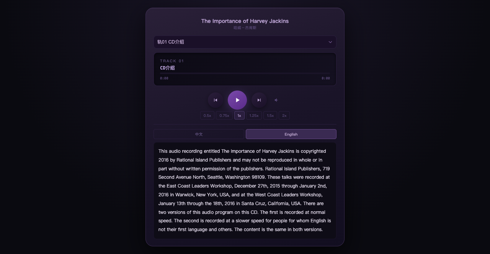

# Retro MP3 Player 🎵

A retro-styled web audio player with bilingual subtitle highlighting, visualizer, and skin switching. Built as a single HTML file + data file — no build tools required.



## Features

- **Dual-language subtitle display** — Chinese/English side-by-side with sentence-level highlighting synchronized to audio playback
- **Spectrum visualizer** — real-time audio frequency bars overlaid on the display panel
- **Speed control** — 0.5x to 2x playback speed
- **Volume** — pop-out slider from the right side
- **Skin switching** — dark/light theme with localStorage persistence
- **Auto-advance** — automatically plays the next track when current one ends
- **Keyboard shortcuts** — Space (play/pause), ←/→ (prev/next), ? (help overlay)
- **PWA ready** — manifest.json included for "Add to Home Screen"
- **Mobile-friendly** — works on iOS/Android browsers with touch controls

## How to use

### 1. Prepare your audio files
Place MP3 files in the `audio/` directory.

### 2. Edit `app/data.js`
The data file contains your track list with this structure:

```js
var M=[{
  "m": "audio/track01.mp3",        // audio file path (relative to app/)
  "l": "Track Title",               // display title
  "cp": ["Chinese paragraph 1",     // Chinese transcript, one string per paragraph
         "Chinese paragraph 2"],
  "ep": ["English paragraph 1",     // English transcript, one string per paragraph
         "English paragraph 2"],
  "wt": [[0.0, 0.5], [0.6, 1.0],   // word-level timestamps [start, end] in seconds
         [1.1, 1.8]]                // must match English word count in order
}];
```

### 3. Serve locally
```bash
cd retro-mp3-player
python3 -m http.server 8765
```
Open http://localhost:8765/app/index.html

### 4. Deploy
Upload the `app/` and `audio/` directories to any web server (nginx, Apache, etc.)

## File structure

```
retro-mp3-player/
├── app/
│   ├── index.html      # Player (all CSS/JS inline)
│   ├── data.js         # Your track data + transcripts
│   └── manifest.json   # PWA manifest
├── audio/              # Put your MP3 files here
├── docs/
│   └── screenshot.png
├── README.md
└── LICENSE
```

## Customization

- **Themes**: edit the `.light` CSS rules in `index.html` to change colors
- **Layout**: all dimensions are in `rem`/`px` — adjust the `.player` max-width
- **Language pairs**: the player supports any language pair (not just Chinese/English) — just replace `cp`/`ep` labels in the HTML

## How to create your own

This project is a **template** — replace the audio and data with your own content:

1. Clone the repo
2. Put your MP3 files in `audio/`
3. Get word-level timestamps via ElevenLabs Scribe
4. Fill `app/data.js` with your transcripts and timestamps
5. Serve locally or deploy

👉 Full step-by-step guide: **[docs/workflow.md](docs/workflow.md)**

## License

MIT
